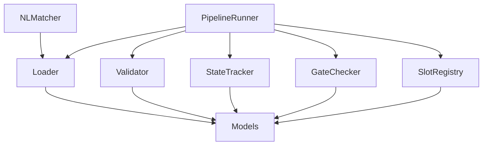
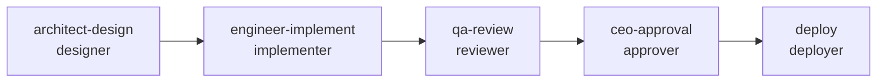

<p align="center">
  <h1 align="center">Agent Orchestrator</h1>
  <p align="center">
    A YAML-driven DAG workflow engine for multi-agent development orchestration
  </p>
</p>

<p align="center">
  
  
  
  
</p>

<p align="center">
  <a href="#quick-start">Quick Start</a> |
  <a href="#architecture">Architecture</a> |
  <a href="#api-reference">API Reference</a> |
  <a href="#pipeline-templates">Templates</a> |
  <a href="docs/README_zh-CN.md">中文文档</a>
</p>

---

## What is Agent Orchestrator?

Agent Orchestrator is a **slot-based pipeline engine** that coordinates multiple AI agents to execute complex development workflows. Instead of hardcoding agent assignments, it defines **what kind of work** each step requires (slot types) and matches agents to slots based on their capabilities.

**Key problem it solves:** When you have a team of specialized AI agents (architect, engineer, QA, researcher, etc.), you need a structured way to:
- Define the sequence and dependencies of work
- Ensure each step's preconditions are met before starting
- Validate deliverables at each gate
- Track pipeline state with persistence and resume capability
- Match the right agent to each task based on capabilities

## Core Features

- **Slot-based Architecture** -- Pipelines define abstract slots (designer, implementer, reviewer) rather than binding to specific agents. Agent assignment is decoupled from workflow definition.
- **DAG Execution** -- Topologically sorted directed acyclic graph with automatic dependency resolution, parallel slot detection, and cycle detection via Kahn's algorithm.
- **Gate Checking** -- Pre/post-condition evaluation supporting 8 gate types: `file_exists`, `slot_completed`, `delivery_valid`, `review_valid`, `tests_pass`, `custom` (YAML field + command), `approval`, `artifact_valid`.
- **Anti-hallucination Protocol** -- Checksum-verified `DELIVERY.yaml` and `REVIEW.yaml` with cross-validation between producer and reviewer metrics.
- **Natural Language Matching** -- Match free-text requests (English and Chinese) to pipeline templates using keyword scoring. No LLM calls -- purely deterministic.
- **State Persistence** -- Atomic YAML-based state tracking with save/load/archive. Resume interrupted pipelines with definition hash verification.
- **Capability Matching** -- Agent capabilities (from YAML front-matter in `.md` files) are matched against slot type requirements to find compatible agents.

## Architecture

The engine consists of 9 modules organized in 3 layers:

```
                    +-------------------+
                    |  PipelineRunner   |   <-- Orchestration layer
                    +-------------------+
                    |                   |
          +---------+    +----------+  +-----------+
          | NLMatcher|   |GateChecker| |SlotRegistry|
          +---------+    +----------+  +-----------+
                    |                   |
          +---------+----+---------+---+-----------+
          |  Loader  | Validator  |  StateTracker  |   <-- Foundation layer
          +----------+-----------+----------------+
                    |
          +-------------------+
          |      Models       |   <-- Data layer
          +-------------------+
```



### Module Summary

| Module | Description | LOC | Coverage |
|--------|------------|-----|----------|
| `models.py` | 5 enums + 14 dataclasses (frozen & mutable) | 292 | 100% |
| `loader.py` | YAML loading + parameter resolution with type coercion | 357 | 95% |
| `validator.py` | DAG validation, cycle detection (Kahn's), IO compatibility | 261 | 100% |
| `state.py` | State tracking, atomic persistence, save/load/archive | 381 | 94% |
| `slot_registry.py` | Slot type registry + agent capability matching | 279 | 92% |
| `gate_checker.py` | Pre/post-condition evaluation for all gate types | 459 | 96% |
| `runner.py` | Top-level orchestration engine | 343 | 99% |
| `nl_matcher.py` | Natural language template matching (EN + CN) | 305 | 96% |
| `__init__.py` | Public API re-exporting 33 symbols | 94 | 100% |

## Quick Start

### Prerequisites

- Python >= 3.11
- PyYAML >= 6.0

```bash
pip install pyyaml
```

### Run Your First Pipeline

```python
import sys, os
sys.path.insert(0, "engineer/src")

from pipeline import PipelineRunner

ROOT = os.getcwd()  # from project root
os.makedirs(f"{ROOT}/state/active", exist_ok=True)

runner = PipelineRunner(
    project_root=ROOT,
    templates_dir=f"{ROOT}/specs/pipelines/templates",
    state_dir=f"{ROOT}/state/active",
    slot_types_dir=f"{ROOT}/specs/pipelines/slot-types",
    agents_dir=f"{ROOT}/agents",
)

# Load and prepare a research pipeline
pipeline, state = runner.prepare(
    f"{ROOT}/specs/pipelines/templates/research-task.yaml",
    {
        "research_topic": "websocket-optimization",
        "research_brief": "Evaluate WebSocket libraries for lower latency",
    },
)

# See what's ready to execute
next_slots = runner.get_next_slots(pipeline, state)
print([s.id for s in next_slots])  # ['research']

# Start a slot
state = runner.begin_slot(next_slots[0], pipeline, state, agent_id="RES-001")

# ... agent does work ...

# Complete the slot
state = runner.complete_slot("research", pipeline, state)

# Print status
print(runner.get_summary(state))
```

### Use Natural Language to Find Templates

```python
from pipeline import NLMatcher

matcher = NLMatcher("specs/pipelines/templates")

# English
results = matcher.match("I need to fix an urgent production bug")
print(results[0].template_id)  # hotfix

# Chinese
results = matcher.match("开发一个新功能实现K线聚合")
print(results[0].template_id)  # standard-feature

# Extract parameters from text
params = matcher.extract_params(
    "implement feature kline-aggregator in phase5",
    "standard-feature"
)
print(params)  # {'feature_name': 'kline-aggregator', 'phase_id': 'phase5'}
```

## API Reference

### PipelineRunner

The main entry point for pipeline orchestration.

```python
runner = PipelineRunner(
    project_root: str,       # Absolute path to project root
    templates_dir: str,      # Path to pipeline template YAMLs
    state_dir: str,          # Path for state file persistence
    slot_types_dir: str,     # Path to slot type definitions
    agents_dir: str,         # Path to agent .md files
)
```

| Method | Description | Returns |
|--------|-------------|---------|
| `prepare(yaml_path, params)` | Load, validate, and init state | `(Pipeline, PipelineState)` |
| `get_next_slots(pipeline, state)` | Get slots ready to execute | `list[Slot]` |
| `begin_slot(slot, pipeline, state, *, agent_id, agent_prompt)` | Start a slot (checks pre-conditions) | `PipelineState` |
| `complete_slot(slot_id, pipeline, state)` | Complete a slot (checks post-conditions) | `PipelineState` |
| `fail_slot(slot_id, error, state)` | Mark a slot as failed | `PipelineState` |
| `skip_slot(slot_id, state)` | Skip a slot (CEO decision) | `PipelineState` |
| `get_summary(state)` | Human-readable status string | `str` |
| `resume_with_pipeline(state_path, yaml_path, params)` | Resume from saved state | `(Pipeline, PipelineState)` |

### NLMatcher

Matches natural language input to pipeline templates.

```python
matcher = NLMatcher(templates_dir: str)
```

| Method | Description | Returns |
|--------|-------------|---------|
| `match(nl_input)` | Find matching templates sorted by confidence | `list[TemplateMatch]` |
| `extract_params(nl_input, template_id)` | Extract parameter values from text | `dict[str, Any]` |
| `generate_summary(match, params)` | Human-readable match summary | `str` |

### SlotRegistry

Manages slot types and agent capability matching.

```python
registry = SlotRegistry(slot_types_dir: str, agents_dir: str)
```

| Method | Description | Returns |
|--------|-------------|---------|
| `load_slot_types()` | Scan and load all slot type YAMLs | `None` |
| `load_agent_capabilities()` | Parse agent .md front-matter | `None` |
| `get_slot_type(slot_type_id)` | Get a slot type definition | `SlotTypeDefinition` |
| `find_compatible_agents(slot_type_id)` | Find agents matching requirements | `list[CapabilityMatch]` |
| `validate_assignment(agent_id, slot_type_id)` | Check if agent can fill slot | `CapabilityMatch` |
| `generate_slot_manifest(pipeline)` | Generate manifest for HR/PMO | `SlotManifest` |

### GateChecker

Evaluates pre/post-conditions for pipeline slots.

| Method | Description | Returns |
|--------|-------------|---------|
| `check_pre_conditions(slot, state)` | Evaluate all pre-conditions | `list[GateCheckResult]` |
| `check_post_conditions(slot, state)` | Evaluate all post-conditions | `list[GateCheckResult]` |
| `all_passed(results)` | Check if all gates passed | `bool` |

## Pipeline Templates

| Template | Slots | Description | Key Parameters |
|----------|-------|-------------|----------------|
| **standard-feature** | 5 (design -> implement -> review -> approve -> deploy) | Full feature development lifecycle | `feature_name`, `phase_id` |
| **research-task** | 3 (research -> architect review -> CEO decision) | Lightweight research and investigation | `research_topic`, `research_brief` |
| **hotfix** | 4 (implement -> review -> approve -> deploy) | Emergency bug fix, skips design phase | `bug_id`, `bug_description`, `affected_module` |
| **quant-strategy** | 6 (scope -> research + design parallel -> implement -> review -> approve) | Quantitative trading strategy development | `strategy_name`, `target_symbol` |
| **security-hardening** | 6 (audit -> remediate design -> implement -> review -> re-audit -> approve) | Two-pass security audit and hardening | `audit_scope` |

### Pipeline DAG Example (standard-feature)



## Slot Types

Slot types define **what kind of work** a slot requires, independent of which agent fills it.

| Slot Type | Category | Description | Required Capabilities |
|-----------|----------|-------------|----------------------|
| **designer** | architecture | Produces design docs and interface definitions | `system_design`, `interface_definition`, `technical_documentation` |
| **implementer** | engineering | Writes production code and tests | `python_development`, `test_writing`, `delivery_protocol` |
| **reviewer** | quality | Independently verifies deliveries | `independent_testing`, `code_review`, `delivery_protocol`, `cross_validation` |
| **researcher** | research | Investigates topics and produces reports | `web_search`, `technical_analysis`, `structured_report_writing` |
| **approver** | governance | Makes Go/No-Go decisions | `decision_making` |
| **auditor** | security | Conducts security audits | `security_audit`, `owasp_review`, `infrastructure_review` |
| **deployer** | operations | Deploys code to environments | `deployment`, `ssh_operations`, `service_management` |

## Extending the System

### Add a New Pipeline Template

Create a YAML file in `specs/pipelines/templates/`:

```yaml
pipeline:
  id: "my-template"
  name: "My Custom Pipeline"
  version: "1.0.0"
  description: "Description of the workflow"
  created_by: "ARCH-001"
  created_at: "2026-01-01T00:00:00Z"

  parameters:
    - name: "my_param"
      type: "string"
      required: true
      description: "A required parameter"

  data_flow:
    - from_slot: "step-a"
      to_slot: "step-b"
      artifact: "output_doc"
      required: true

  slots:
    - id: "step-a"
      slot_type: "researcher"
      name: "Step A"
      depends_on: []
      # ... inputs, outputs, conditions, task, execution

    - id: "step-b"
      slot_type: "implementer"
      name: "Step B"
      depends_on: ["step-a"]
      # ...
```

### Add a New Slot Type

Create a YAML file in `specs/pipelines/slot-types/`:

```yaml
slot_type:
  id: "my-slot-type"
  name: "My Custom Role"
  category: "engineering"
  description: "What this role does"

  input_schema:
    type: object
    required: [input_doc]
    properties:
      input_doc:
        type: string
        description: "Path to input document"

  output_schema:
    type: object
    required: [output_doc]
    properties:
      output_doc:
        type: string
        description: "Path to output document"

  required_capabilities:
    - capability_a
    - capability_b

  constraints:
    - "Must follow constraint X"
```

### Add a New Agent

Create a Markdown file in `agents/` with YAML front-matter:

```markdown
---
agent_id: "MY-001"
name: "My Agent"
capabilities:
  - capability_a
  - capability_b
  - capability_c
max_concurrent_slots: 1
---

# My Agent

Agent prompt and instructions here...
```

The `SlotRegistry` will automatically parse the front-matter and include this agent in capability matching.

## Project Structure

```
agent-orchestrator/
  agents/                          # Agent prompt definitions (.md with YAML front-matter)
    00-hr-agent.md
    01-architect-agent.md
    02-engineer-agent.md
    03-qa-agent.md
    ...
  architect/                       # Architecture docs and deliveries
    architecture.md
    DELIVERY.yaml
  engineer/                        # Pipeline engine implementation
    src/
      pipeline/
        __init__.py                # Public API (33 exports)
        models.py                  # Enums + dataclasses
        loader.py                  # YAML loader + param resolution
        validator.py               # DAG validation + cycle detection
        state.py                   # State persistence + tracking
        slot_registry.py           # Slot types + capability matching
        gate_checker.py            # Pre/post-condition gates
        runner.py                  # Orchestration engine
        nl_matcher.py              # NL template matching
    tests/
      test_pipeline/
        conftest.py                # Shared fixtures
        fixtures/                  # Test YAML/MD fixtures
        test_*.py                  # 270 tests
    DELIVERY.yaml                  # Anti-hallucination delivery manifest
  qa/                              # QA review artifacts
    REVIEW.yaml
    additional-tests/
  pmo/                             # Project management
    wbs/implementation-wbs.md
    team-registry.md
  specs/                           # Specifications
    integration-contract.md        # Interface contracts for all modules
    delivery-protocol.md           # DELIVERY/REVIEW.yaml schemas
    pipelines/
      templates/                   # Pipeline YAML templates (5)
      slot-types/                  # Slot type definitions (7)
      schema.yaml                  # Pipeline YAML schema
      implementation-guide.md      # Module implementation specs
    research/
      pluggable-pipeline-research.md
  docs/
    README_zh-CN.md                # Chinese documentation
  QUICKSTART.md                    # Quick start guide
  FILE-STANDARD.md                 # File/directory conventions
```

## Testing

```bash
cd engineer
PYTHONPATH=src python3 -m pytest tests/test_pipeline/ -v --cov=src/pipeline --cov-report=term-missing
```

**Results:** 270 tests passed, 97% overall coverage.

```
Module                  Stmts   Coverage
pipeline.__init__           9     100%
pipeline.models           175     100%
pipeline.loader           127      95%
pipeline.validator        123     100%
pipeline.state            152      94%
pipeline.slot_registry    106      92%
pipeline.gate_checker     184      96%
pipeline.runner            93      99%
pipeline.nl_matcher        96      96%
TOTAL                    1065      97%
```

## Anti-hallucination Protocol

This project uses a structured delivery protocol to prevent AI agents from hallucinating test results:

- **DELIVERY.yaml** -- Producer declares file checksums, test counts, coverage. Each file has a sha256 checksum.
- **REVIEW.yaml** -- Reviewer independently runs tests, computes checksums, and cross-validates against producer claims.
- **Cross-validation** -- If QA metrics deviate from producer metrics beyond threshold, the delivery is flagged as suspicious and cannot pass.

See `specs/delivery-protocol.md` for the full specification.

## Contributing

1. Fork the repository
2. Create a feature branch: `git checkout -b feature/my-feature`
3. Follow the integration contract in `specs/integration-contract.md`
4. Write tests with >= 85% coverage
5. Produce a `DELIVERY.yaml` per `specs/delivery-protocol.md`
6. Submit a pull request

## License

This project is licensed under the Apache License 2.0. See [LICENSE](LICENSE) for details.

---

<p align="center">
  Built with slot-based orchestration -- defining what work needs to happen, not who does it.
</p>
