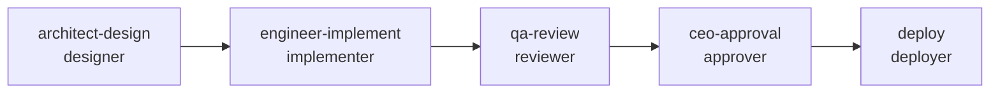
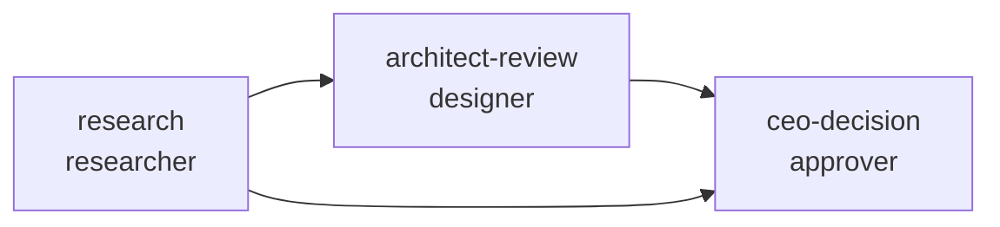
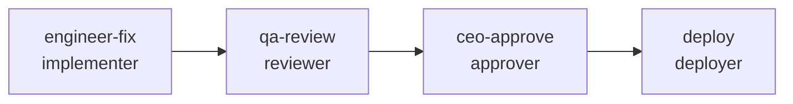

<p align="center">
  <h1 align="center">Agent Orchestrator</h1>
  <p align="center">
    A slot-based pipeline engine for orchestrating AI agent teams via YAML workflows
  </p>
</p>

<p align="center">
  
  
  
  
</p>

<p align="center">
  <a href="#5-minute-setup">5-Minute Setup</a> |
  <a href="#use-cases">Use Cases</a> |
  <a href="#slot-protocol">Slot Protocol</a> |
  <a href="#writing-pipelines">Writing Pipelines</a> |
  <a href="docs/README_zh-CN.md">中文文档</a>
</p>

---

## What is This?

Agent Orchestrator lets you **define multi-agent workflows in YAML** and have a Claude Code team lead execute them automatically. Instead of manually coordinating which agent does what, you describe the workflow as a DAG of typed slots, and the engine handles sequencing, gate-checking, state tracking, and capability matching.

**Who is this for:**
- **Humans** who want to set up structured AI agent pipelines for their projects
- **AI team leads** (Claude Code) who need to orchestrate agent teammates through multi-step workflows

**Core insight:** Topology and personnel are orthogonal. A pipeline defines *what kind of work* needs to happen (via slot types). Agent assignment is separate. Swap an agent without touching the pipeline. Swap the pipeline without touching the agents.

---

## 5-Minute Setup

### 1. Project Structure

Your project needs these directories:

```
your-project/
  agents/                     # Agent prompts (.md with YAML front-matter)
  specs/pipelines/
    templates/                # Pipeline YAML definitions
    slot-types/               # Slot type contracts
  state/active/               # Runtime state (engine-managed)
  engineer/src/pipeline/      # Engine source code (copy from this repo)
```

### 2. CLAUDE.md Configuration

Add this to your project's `CLAUDE.md` so the team lead knows about the pipeline system:

```markdown
## Pipeline Orchestration

This project uses Agent Orchestrator for workflow management.

When the user requests a feature, research task, or hotfix:
1. Use NLMatcher to find the right pipeline template
2. Call PipelineRunner.prepare() with the template and parameters
3. Loop: get_next_slots() -> begin_slot() -> spawn agent -> complete_slot()
4. Track state in state/active/

Pipeline templates: specs/pipelines/templates/
Slot types: specs/pipelines/slot-types/
Agent prompts: agents/

Key files to read:
- specs/integration-contract.md (module interfaces)
- specs/delivery-protocol.md (DELIVERY/REVIEW.yaml format)
- FILE-STANDARD.md (directory conventions)
```

### 3. Agent Prompt Setup

Every agent `.md` file needs YAML front-matter declaring its capabilities:

```markdown
---
agent_id: "ENG-001"
version: "2.1"
capabilities:
  - python_development
  - test_writing
  - delivery_protocol
compatible_slot_types:
  - implementer
  - deployer
---

# Engineer Agent

Your behavioral instructions here...
```

The `capabilities` list determines which slots this agent can fill. The engine checks: `agent.capabilities SUPERSET_OF slot_type.required_capabilities`.

### 4. Install

```bash
pip install pyyaml   # Only external dependency
```

---

## Use Cases

### "I want to develop a new feature"

Tell your Claude Code team lead:

> "Implement feature kline-aggregator in phase5"

or in Chinese:

> "开发一个新功能实现K线聚合"

**What happens:** The team lead matches this to the `standard-feature` pipeline and executes:



**Step by step:**

1. **NLMatcher** identifies `standard-feature` template, extracts `feature_name=kline-aggregator`, `phase_id=phase5`
2. **PipelineRunner.prepare()** loads the template, resolves parameters, validates the DAG, initializes state
3. **Slot 1 -- architect-design** (designer slot):
   - Pre-condition: `integration-contract.md` exists
   - Agent reads requirements, produces design doc at `architect/phase5/kline-aggregator-design.md`
   - Post-condition: design doc file exists
4. **Slot 2 -- engineer-implement** (implementer slot):
   - Pre-condition: design doc available
   - Agent reads design doc, writes code in `engineer/src/`, tests in `engineer/tests/`, produces `DELIVERY.yaml`
   - Post-condition: DELIVERY.yaml valid, all tests pass
5. **Slot 3 -- qa-review** (reviewer slot):
   - Pre-condition: DELIVERY.yaml valid
   - Agent independently runs tests, cross-validates metrics, produces `REVIEW.yaml`
   - Post-condition: REVIEW.yaml valid
6. **Slot 4 -- ceo-approval** (approver slot):
   - Pre-condition: QA verdict is not "fail"
   - Team lead reviews verdict, makes Go/No-Go decision
7. **Slot 5 -- deploy** (deployer slot):
   - Pre-condition: CEO approved, PVE snapshot taken
   - Agent deploys code, restarts service, runs smoke tests

### "I need to research a technical approach"

> "Research WebSocket optimization for lower latency"

**Pipeline:** `research-task` (3 slots)



1. **Researcher** investigates the topic, produces a report with findings, sources, and recommendations
2. **Architect** reviews for feasibility and compatibility with existing system
3. **CEO** decides which recommendations to implement (and which pipeline to use next)

No code is produced -- output is research reports and Go/No-Go decisions.

### "Urgent production bug needs fixing"

> "Emergency fix: AI parsing returns null 1/3 of the time, bug P1-042 in strategy module"

**Pipeline:** `hotfix` (4 slots, skips design phase)



1. **Engineer** fixes the bug directly (no design phase), produces DELIVERY.yaml
2. **QA** runs full test suite, verifies no regressions
3. **CEO** approves
4. **Deploy** to production

Constraints enforced: minimal change only, must add regression test, must not break existing interfaces.

---

## How the Team Lead Runs a Pipeline

This section is for the **AI team lead** (Claude Code) that orchestrates the pipeline.

### Triggering via Natural Language

```python
from pipeline import NLMatcher

matcher = NLMatcher("specs/pipelines/templates")

# These all work:
matcher.match("implement a new dashboard feature")     # -> standard-feature
matcher.match("做量化策略优化 BTC/USDT")                  # -> quant-strategy
matcher.match("research websocket performance")        # -> research-task
matcher.match("紧急修复 AI 解析 bug")                     # -> hotfix
matcher.match("security audit the API endpoints")      # -> security-hardening
```

### Execution Loop

```python
from pipeline import PipelineRunner

runner = PipelineRunner(
    project_root=ROOT,
    templates_dir=f"{ROOT}/specs/pipelines/templates",
    state_dir=f"{ROOT}/state/active",
    slot_types_dir=f"{ROOT}/specs/pipelines/slot-types",
    agents_dir=f"{ROOT}/agents",
)

# 1. Prepare
pipeline, state = runner.prepare(template_path, params)

# 2. Execute slot by slot
while True:
    next_slots = runner.get_next_slots(pipeline, state)
    if not next_slots:
        break

    for slot in next_slots:
        # Begin slot (checks pre-conditions, marks IN_PROGRESS)
        state = runner.begin_slot(slot, pipeline, state,
                                  agent_id="ENG-001",
                                  agent_prompt="agents/02-engineer-agent.md")

        # Spawn the agent teammate and wait for completion
        # ... (via Claude Code Agent Teams) ...

        # Complete slot (checks post-conditions, marks COMPLETED)
        state = runner.complete_slot(slot.id, pipeline, state)

# 3. Check final status
print(runner.get_summary(state))
```

### Handling Failures

```python
# If an agent fails:
state = runner.fail_slot("engineer-implement", "Agent crashed", state)

# If CEO decides to skip a slot:
state = runner.skip_slot("deploy", state)

# Resume from saved state after interruption:
pipeline, state = runner.resume_with_pipeline(
    "state/active/standard-feature-2026-02-17.state.yaml",
    template_path, params
)
```

---

## Slot Protocol

Every agent interacting with the pipeline follows this protocol:

### Input (what the agent receives)

The engine generates `slot-input.yaml` for each slot:

```yaml
slot_id: "engineer-implement"
slot_type: "implementer"
pipeline_id: "standard-feature-2026-02-17"

task:
  objective: "Implement kline-aggregator per architecture design"
  constraints:
    - "Follow integration contract interfaces exactly"
    - "Must achieve >= 85% test coverage"
  deliverables:
    - "Source code in engineer/src/"
    - "Tests in engineer/tests/"
    - "DELIVERY.yaml with checksums"

inputs:
  design_doc:
    from_slot: "architect-design"
    path: "architect/phase5/kline-aggregator-design.md"
  integration_contract:
    path: "specs/integration-contract.md"

output_requirements:
  required_fields: [delivery_yaml, source_dir, test_dir]
  output_path: "state/active/artifacts/engineer-implement/"
```

### Output (what the agent produces)

The agent writes `slot-output.yaml`:

```yaml
slot_id: "engineer-implement"
status: "completed"
completed_at: "2026-02-17T18:30:00Z"

output:
  delivery_yaml: "engineer/DELIVERY.yaml"
  source_dir: "engineer/src/"
  test_dir: "engineer/tests/"

metadata:
  agent_id: "ENG-001"
  test_count: 270
  coverage_pct: 97
```

### Protocol Summary

```
1. READ   slot-input.yaml        (generated by engine)
2. READ   own agent prompt .md   (behavioral instructions)
3. READ   upstream artifacts      (design docs, research reports, etc.)
4. EXEC   do work                (write code, research, review, etc.)
5. WRITE  artifacts              (code, reports, DELIVERY.yaml, etc.)
6. WRITE  slot-output.yaml       (conforms to slot type's output_schema)
```

---

## Gate Mechanism

Gates are pre-conditions and post-conditions that enforce quality at each step.

### Pre-conditions (checked before slot starts)

| Gate Type | What It Checks | Example |
|-----------|---------------|---------|
| `file_exists` | File exists at path | `integration-contract.md` |
| `slot_completed` | Another slot has completed | `architect-design` |
| `artifact_valid` | Upstream artifact exists and is valid | `design_doc.md` |
| `approval` | Human approval received | `ceo_deploy_approval` |
| `custom` | YAML field check or shell command | `yaml_field:REVIEW.yaml:verdict != fail` |

### Post-conditions (checked after slot completes)

| Gate Type | What It Checks | Example |
|-----------|---------------|---------|
| `delivery_valid` | DELIVERY.yaml passes validation | `engineer/DELIVERY.yaml` |
| `review_valid` | REVIEW.yaml passes validation | `qa/REVIEW.yaml` |
| `tests_pass` | Test suite passes | `engineer/tests/` |
| `custom` | Shell command exit code | `ssh trading-vm systemctl is-active trading` |

If a post-condition fails, the slot is marked FAILED and can be retried (up to `max_retries`).

---

## Data Flow Between Slots

Data flows through the pipeline via explicit edges defined in `data_flow[]`:

```yaml
data_flow:
  - from_slot: "architect-design"
    to_slot: "engineer-implement"
    artifact: "design_doc"
    required: true        # Blocks engineer until architect completes

  - from_slot: "engineer-implement"
    to_slot: "qa-review"
    artifact: "delivery"
    required: true
```

- `required: true` means the downstream slot is blocked until the upstream slot completes
- `required: false` means optional enrichment (slot can start without it)
- The engine computes execution order from the union of `depends_on` and required `data_flow` edges using Kahn's algorithm

Artifacts are files written by one slot and read by the next. The slot type's `output_schema` defines what artifacts a slot must produce.

---

## State Tracking

Pipeline state is persisted as `.state.yaml` files in `state/active/`:

```yaml
pipeline_id: "standard-feature"
pipeline_version: "2.0.0"
status: "running"
started_at: "2026-02-17T10:00:00Z"

slots:
  architect-design:
    status: "completed"
    agent_id: "ARCH-001"
    started_at: "2026-02-17T10:00:00Z"
    completed_at: "2026-02-17T11:30:00Z"
  engineer-implement:
    status: "in_progress"
    agent_id: "ENG-001"
    started_at: "2026-02-17T11:35:00Z"
  qa-review:
    status: "blocked"
  ceo-approve:
    status: "pending"
  deploy:
    status: "pending"
```

State is saved atomically after every status change. If the process crashes, `runner.resume_with_pipeline()` reloads from the last saved state.

### Slot State Machine

```
PENDING -> BLOCKED -> READY -> PRE_CHECK -> IN_PROGRESS -> POST_CHECK -> COMPLETED
                                  |              |               |
                                FAILED         FAILED          FAILED
                                                 |
                                              RETRYING (up to max_retries)

                          Any state -> SKIPPED (CEO decision)
```

---

## Writing Pipelines

### Template Structure

```yaml
pipeline:
  id: "my-workflow"                    # kebab-case
  name: "My Custom Workflow"
  version: "1.0.0"
  description: "What this pipeline does"
  created_by: "ARCH-001"
  created_at: "2026-01-01T00:00:00Z"

  parameters:                          # User-supplied values
    - name: "feature_name"
      type: "string"
      required: true
      description: "Name of the feature"

  data_flow:                           # Explicit DAG edges
    - from_slot: "design"
      to_slot: "implement"
      artifact: "design_doc"
      required: true

  slots:                               # The work units
    - id: "design"
      slot_type: "designer"            # References a SlotType definition
      name: "Design Phase"
      depends_on: []
      task:
        objective: "Design {feature_name}"
        deliverables: ["Design document"]
      outputs:
        - name: "design_doc"
          type: "design_doc"
          path: "architect/{feature_name}-design.md"
      post_conditions:
        - check: "Design doc exists"
          type: "file_exists"
          target: "architect/{feature_name}-design.md"

    - id: "implement"
      slot_type: "implementer"
      name: "Implementation Phase"
      depends_on: ["design"]
      # ...
```

Parameters use `{param_name}` placeholders that get resolved at runtime.

### Available Slot Types

| Slot Type | Category | What It Does | Required Capabilities |
|-----------|----------|-------------|----------------------|
| `designer` | architecture | Design docs, interface definitions | `system_design`, `interface_definition`, `technical_documentation` |
| `implementer` | engineering | Production code + tests | `python_development`, `test_writing`, `delivery_protocol` |
| `reviewer` | quality | Independent verification | `independent_testing`, `code_review`, `delivery_protocol`, `cross_validation` |
| `researcher` | research | Investigation and reports | `web_search`, `technical_analysis`, `structured_report_writing` |
| `approver` | governance | Go/No-Go decisions | `decision_making` |
| `deployer` | operations | Deploy to environments | `deployment`, `ssh_operations`, `service_management` |
| `auditor` | security | Security audits | `security_audit`, `owasp_review`, `infrastructure_review` |

### Creating a New Slot Type

Create a YAML file in `specs/pipelines/slot-types/`:

```yaml
slot_type:
  id: "data-analyst"
  name: "Data Analyst"
  category: "research"
  description: "Analyzes datasets and produces statistical reports"

  input_schema:
    type: object
    required: [dataset_path]
    properties:
      dataset_path:
        type: string
        description: "Path to the dataset"

  output_schema:
    type: object
    required: [analysis_report]
    properties:
      analysis_report:
        type: string
        description: "Path to the analysis report"

  required_capabilities:
    - data_analysis
    - statistical_modeling
    - visualization
```

The SlotRegistry auto-discovers new slot types. No engine code changes needed.

---

## Pipeline Templates

| Template | Slots | When to Use |
|----------|-------|-------------|
| `standard-feature` | design -> implement -> review -> approve -> deploy | New features and enhancements |
| `research-task` | research -> architect review -> CEO decision | Technical investigation, no code output |
| `hotfix` | fix -> review -> approve -> deploy | Urgent bug fixes (skips design) |
| `quant-strategy` | scope -> signal research + market research (parallel) -> implement -> review -> approve | Trading strategy development |
| `security-hardening` | initial audit -> remediation design -> implement -> review -> re-audit -> approve | Two-pass security work |

---

## Anti-hallucination Protocol

The system prevents AI agents from fabricating test results:

- **DELIVERY.yaml** -- Producer declares file checksums (SHA256), test counts, and coverage. Every file has a verifiable checksum.
- **REVIEW.yaml** -- QA independently runs tests, computes checksums, and cross-validates against producer claims.
- **Cross-validation** -- If QA metrics deviate from producer metrics beyond threshold, the delivery is flagged as `suspicious` and cannot pass review.

---

## Project Structure

```
agent-orchestrator/
  agents/                          # Agent prompts (.md with YAML front-matter)
  architect/                       # Architect working directory
    architecture.md                # System architecture document
  engineer/                        # Engine implementation
    src/pipeline/                  # 9 modules, ~1065 LOC
    tests/test_pipeline/           # 270 tests, 97% coverage
  qa/                              # QA review artifacts
  pmo/                             # Project management
  specs/
    pipelines/
      templates/                   # 5 pipeline templates
      slot-types/                  # 7 slot type definitions
      schema.yaml                  # Pipeline YAML schema
      implementation-guide.md      # Module specs
    integration-contract.md        # Interface contracts
    delivery-protocol.md           # DELIVERY/REVIEW protocol
  state/                           # Runtime state (engine-managed)
    active/                        # Running pipelines
    archive/                       # Completed pipelines
  docs/
    README_zh-CN.md                # Chinese documentation
  FILE-STANDARD.md                 # Directory conventions
```

---

## Testing

```bash
cd engineer
PYTHONPATH=src python3 -m pytest tests/test_pipeline/ -v --cov=src/pipeline --cov-report=term-missing
# 270 passed, 97% overall coverage
```

## Contributing

1. Fork the repository
2. Create a feature branch
3. Follow `specs/integration-contract.md` for interfaces
4. Write tests with >= 85% coverage
5. Produce `DELIVERY.yaml` per `specs/delivery-protocol.md`
6. Submit a pull request

## License

Apache License 2.0. See [LICENSE](LICENSE) for details.

---

<p align="center">
  Define what work needs to happen, not who does it. Let the engine match agents to slots.
</p>
