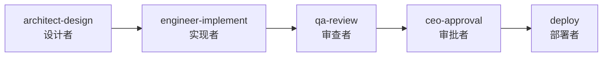
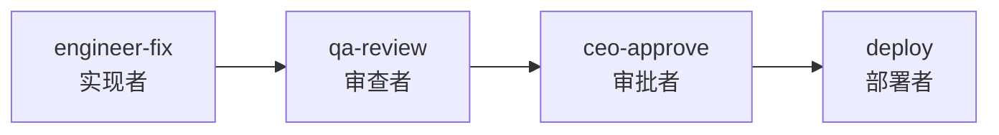

<p align="center">
  <h1 align="center">Agent Orchestrator</h1>
  <p align="center">
    基于槽位的流水线引擎，通过 YAML 工作流编排 AI 智能体团队
  </p>
</p>

<p align="center">
  
  
  
  
</p>

<p align="center">
  <a href="#5-分钟上手">5 分钟上手</a> |
  <a href="#使用场景">使用场景</a> |
  <a href="#槽位协议">槽位协议</a> |
  <a href="#编写流水线">编写流水线</a> |
  <a href="../README.md">English</a>
</p>

---

## 这是什么？

Agent Orchestrator 让你**用 YAML 定义多智能体工作流**，然后由 Claude Code 团队负责人自动执行。不再需要手动协调哪个智能体做什么，你只需将工作流描述为一个由类型化槽位组成的 DAG，引擎负责排序、关卡检查、状态跟踪和能力匹配。

**谁会用到这个：**
- **人类** -- 想为自己的项目搭建结构化的 AI 智能体流水线
- **AI 团队负责人**（Claude Code）-- 需要协调智能体队友完成多步骤工作流

**核心洞察：** 拓扑与人员是正交关系。流水线定义*需要做什么类型的工作*（通过槽位类型）。智能体分配是独立的。换人不需要改流水线。换流水线不需要换人。

---

## 5 分钟上手

### 1. 项目目录结构

你的项目需要这些目录：

```
your-project/
  agents/                     # 智能体提示词（.md + YAML front-matter）
  specs/pipelines/
    templates/                # 流水线 YAML 定义
    slot-types/               # 槽位类型契约
  state/active/               # 运行时状态（引擎管理）
  engineer/src/pipeline/      # 引擎源码（从本仓库复制）
```

### 2. CLAUDE.md 配置

在项目的 `CLAUDE.md` 中加入以下内容，让团队负责人了解流水线系统：

```markdown
## 流水线编排

本项目使用 Agent Orchestrator 进行工作流管理。

当用户请求功能开发、技术调研或紧急修复时：
1. 使用 NLMatcher 找到匹配的流水线模板
2. 调用 PipelineRunner.prepare() 加载模板和参数
3. 循环：get_next_slots() -> begin_slot() -> 派出智能体 -> complete_slot()
4. 状态跟踪在 state/active/

流水线模板：specs/pipelines/templates/
槽位类型：specs/pipelines/slot-types/
智能体提示词：agents/

必读文件：
- specs/integration-contract.md（模块接口）
- specs/delivery-protocol.md（DELIVERY/REVIEW.yaml 格式）
- FILE-STANDARD.md（目录规范）
```

### 3. 智能体提示词配置

每个智能体 `.md` 文件需要 YAML front-matter 声明其能力：

```markdown
---
agent_id: "ENG-001"
version: "2.1"
capabilities:
  - python_development
  - test_writing
  - delivery_protocol
compatible_slot_types:
  - implementer
  - deployer
---

# 工程师智能体

行为指令写在这里...
```

`capabilities` 列表决定该智能体能填入哪些槽位。引擎检查规则：`agent.capabilities SUPERSET_OF slot_type.required_capabilities`。

### 4. 安装

```bash
pip install pyyaml   # 唯一的外部依赖
```

---

## 使用场景

### "我想开发一个新功能"

告诉你的 Claude Code 团队负责人：

> "开发一个新功能实现K线聚合"

或者用英文：

> "Implement feature kline-aggregator in phase5"

**会发生什么：** 团队负责人匹配到 `standard-feature` 流水线并执行：



**逐步流程：**

1. **NLMatcher** 识别出 `standard-feature` 模板，提取 `feature_name=kline-aggregator`，`phase_id=phase5`
2. **PipelineRunner.prepare()** 加载模板、解析参数、验证 DAG、初始化状态
3. **槽位 1 -- architect-design**（设计者槽位）：
   - 前置条件：`integration-contract.md` 存在
   - 智能体阅读需求，产出设计文档 `architect/phase5/kline-aggregator-design.md`
   - 后置条件：设计文档文件存在
4. **槽位 2 -- engineer-implement**（实现者槽位）：
   - 前置条件：设计文档可用
   - 智能体阅读设计文档，在 `engineer/src/` 写代码、`engineer/tests/` 写测试、产出 `DELIVERY.yaml`
   - 后置条件：DELIVERY.yaml 有效，所有测试通过
5. **槽位 3 -- qa-review**（审查者槽位）：
   - 前置条件：DELIVERY.yaml 有效
   - 智能体独立运行测试，交叉验证指标，产出 `REVIEW.yaml`
   - 后置条件：REVIEW.yaml 有效
6. **槽位 4 -- ceo-approval**（审批者槽位）：
   - 前置条件：QA 判定不是 "fail"
   - 团队负责人审查判定，做出通过/拒绝决策
7. **槽位 5 -- deploy**（部署者槽位）：
   - 前置条件：CEO 已批准，PVE 快照已创建
   - 智能体部署代码、重启服务、运行冒烟测试

### "需要调研一个技术方案"

> "调研 WebSocket 优化方案以降低延迟"

**流水线：** `research-task`（3 个槽位）


1. **研究者** 调研课题，产出包含发现、来源和建议的报告
2. **架构师** 审查可行性和与现有系统的兼容性
3. **CEO** 决定采纳哪些建议（以及接下来使用哪个流水线实施）

不产出代码 -- 输出是研究报告和通过/拒绝决策。

### "紧急修复生产 Bug"

> "紧急修复：AI 解析有 1/3 概率返回 null，bug P1-042 在 strategy 模块"

**流水线：** `hotfix`（4 个槽位，跳过设计阶段）



1. **工程师** 直接修复 bug（无设计阶段），产出 DELIVERY.yaml
2. **QA** 运行全量测试，验证无回归
3. **CEO** 审批
4. **部署** 到生产环境

强制约束：仅做最小改动、必须添加回归测试、不能破坏现有接口。

---

## 团队负责人如何运行流水线

本节面向执行流水线编排的 **AI 团队负责人**（Claude Code）。

### 通过自然语言触发

```python
from pipeline import NLMatcher

matcher = NLMatcher("specs/pipelines/templates")

# 以下都能匹配：
matcher.match("implement a new dashboard feature")     # -> standard-feature
matcher.match("做量化策略优化 BTC/USDT")                  # -> quant-strategy
matcher.match("research websocket performance")        # -> research-task
matcher.match("紧急修复 AI 解析 bug")                     # -> hotfix
matcher.match("security audit the API endpoints")      # -> security-hardening
```

### 执行循环

```python
from pipeline import PipelineRunner

runner = PipelineRunner(
    project_root=ROOT,
    templates_dir=f"{ROOT}/specs/pipelines/templates",
    state_dir=f"{ROOT}/state/active",
    slot_types_dir=f"{ROOT}/specs/pipelines/slot-types",
    agents_dir=f"{ROOT}/agents",
)

# 1. 准备
pipeline, state = runner.prepare(template_path, params)

# 2. 逐槽位执行
while True:
    next_slots = runner.get_next_slots(pipeline, state)
    if not next_slots:
        break

    for slot in next_slots:
        # 启动槽位（检查前置条件，标记 IN_PROGRESS）
        state = runner.begin_slot(slot, pipeline, state,
                                  agent_id="ENG-001",
                                  agent_prompt="agents/02-engineer-agent.md")

        # 派出智能体队友并等待完成
        # ...（通过 Claude Code Agent Teams）...

        # 完成槽位（检查后置条件，标记 COMPLETED）
        state = runner.complete_slot(slot.id, pipeline, state)

# 3. 查看最终状态
print(runner.get_summary(state))
```

### 处理失败

```python
# 智能体执行失败时：
state = runner.fail_slot("engineer-implement", "Agent crashed", state)

# CEO 决定跳过某个槽位：
state = runner.skip_slot("deploy", state)

# 中断后从保存的状态恢复：
pipeline, state = runner.resume_with_pipeline(
    "state/active/standard-feature-2026-02-17.state.yaml",
    template_path, params
)
```

---

## 槽位协议

每个与流水线交互的智能体都遵循以下协议：

### 输入（智能体接收的内容）

引擎为每个槽位生成 `slot-input.yaml`：

```yaml
slot_id: "engineer-implement"
slot_type: "implementer"
pipeline_id: "standard-feature-2026-02-17"

task:
  objective: "按架构设计实现 kline-aggregator"
  constraints:
    - "严格遵循接口契约"
    - "测试覆盖率必须 >= 85%"
  deliverables:
    - "源代码在 engineer/src/"
    - "测试在 engineer/tests/"
    - "带校验和的 DELIVERY.yaml"

inputs:
  design_doc:
    from_slot: "architect-design"
    path: "architect/phase5/kline-aggregator-design.md"
  integration_contract:
    path: "specs/integration-contract.md"

output_requirements:
  required_fields: [delivery_yaml, source_dir, test_dir]
  output_path: "state/active/artifacts/engineer-implement/"
```

### 输出（智能体产出的内容）

智能体写入 `slot-output.yaml`：

```yaml
slot_id: "engineer-implement"
status: "completed"
completed_at: "2026-02-17T18:30:00Z"

output:
  delivery_yaml: "engineer/DELIVERY.yaml"
  source_dir: "engineer/src/"
  test_dir: "engineer/tests/"

metadata:
  agent_id: "ENG-001"
  test_count: 270
  coverage_pct: 97
```

### 协议摘要

```
1. READ   slot-input.yaml        （引擎生成）
2. READ   自己的智能体 .md 提示词   （行为指令）
3. READ   上游产物                 （设计文档、研究报告等）
4. EXEC   执行工作                 （写代码、调研、审查等）
5. WRITE  产物                    （代码、报告、DELIVERY.yaml 等）
6. WRITE  slot-output.yaml        （符合槽位类型的 output_schema）
```

---

## 关卡机制

关卡是前置条件和后置条件，在每个步骤强制保证质量。

### 前置条件（槽位启动前检查）

| 关卡类型 | 检查内容 | 示例 |
|----------|---------|------|
| `file_exists` | 文件是否存在 | `integration-contract.md` |
| `slot_completed` | 另一个槽位是否已完成 | `architect-design` |
| `artifact_valid` | 上游产物是否存在且有效 | `design_doc.md` |
| `approval` | 是否已获得人工审批 | `ceo_deploy_approval` |
| `custom` | YAML 字段检查或 shell 命令 | `yaml_field:REVIEW.yaml:verdict != fail` |

### 后置条件（槽位完成后检查）

| 关卡类型 | 检查内容 | 示例 |
|----------|---------|------|
| `delivery_valid` | DELIVERY.yaml 是否通过验证 | `engineer/DELIVERY.yaml` |
| `review_valid` | REVIEW.yaml 是否通过验证 | `qa/REVIEW.yaml` |
| `tests_pass` | 测试套件是否通过 | `engineer/tests/` |
| `custom` | Shell 命令退出码 | `ssh trading-vm systemctl is-active trading` |

如果后置条件失败，槽位被标记为 FAILED，可以重试（最多 `max_retries` 次）。

---

## 槽位间的数据流

数据通过 `data_flow[]` 中定义的显式边在流水线中流动：

```yaml
data_flow:
  - from_slot: "architect-design"
    to_slot: "engineer-implement"
    artifact: "design_doc"
    required: true        # 阻塞工程师直到架构师完成

  - from_slot: "engineer-implement"
    to_slot: "qa-review"
    artifact: "delivery"
    required: true
```

- `required: true` 表示下游槽位被阻塞，直到上游槽位完成
- `required: false` 表示可选的数据补充（槽位可以在没有它的情况下启动）
- 引擎使用 Kahn 算法，从 `depends_on` 和 required `data_flow` 边的并集计算执行顺序

产物是由一个槽位写入、由下一个槽位读取的文件。槽位类型的 `output_schema` 定义了槽位必须产出哪些产物。

---

## 状态跟踪

流水线状态以 `.state.yaml` 文件持久化在 `state/active/` 目录：

```yaml
pipeline_id: "standard-feature"
pipeline_version: "2.0.0"
status: "running"
started_at: "2026-02-17T10:00:00Z"

slots:
  architect-design:
    status: "completed"
    agent_id: "ARCH-001"
    started_at: "2026-02-17T10:00:00Z"
    completed_at: "2026-02-17T11:30:00Z"
  engineer-implement:
    status: "in_progress"
    agent_id: "ENG-001"
    started_at: "2026-02-17T11:35:00Z"
  qa-review:
    status: "blocked"
  ceo-approve:
    status: "pending"
  deploy:
    status: "pending"
```

每次状态变更后原子性保存。如果进程崩溃，`runner.resume_with_pipeline()` 从最后保存的状态恢复。

### 槽位状态机

```
PENDING -> BLOCKED -> READY -> PRE_CHECK -> IN_PROGRESS -> POST_CHECK -> COMPLETED
                                  |              |               |
                                FAILED         FAILED          FAILED
                                                 |
                                              RETRYING（最多 max_retries 次）

                          任意状态 -> SKIPPED（CEO 决策）
```

---

## 编写流水线

### 模板结构

```yaml
pipeline:
  id: "my-workflow"                    # kebab-case
  name: "我的自定义工作流"
  version: "1.0.0"
  description: "这个流水线做什么"
  created_by: "ARCH-001"
  created_at: "2026-01-01T00:00:00Z"

  parameters:                          # 用户提供的值
    - name: "feature_name"
      type: "string"
      required: true
      description: "功能名称"

  data_flow:                           # 显式 DAG 边
    - from_slot: "design"
      to_slot: "implement"
      artifact: "design_doc"
      required: true

  slots:                               # 工作单元
    - id: "design"
      slot_type: "designer"            # 引用 SlotType 定义
      name: "设计阶段"
      depends_on: []
      task:
        objective: "设计 {feature_name}"
        deliverables: ["设计文档"]
      outputs:
        - name: "design_doc"
          type: "design_doc"
          path: "architect/{feature_name}-design.md"
      post_conditions:
        - check: "设计文档存在"
          type: "file_exists"
          target: "architect/{feature_name}-design.md"

    - id: "implement"
      slot_type: "implementer"
      name: "实现阶段"
      depends_on: ["design"]
      # ...
```

参数使用 `{param_name}` 占位符，在运行时解析。

### 可用的槽位类型

| 槽位类型 | 类别 | 做什么 | 要求的能力 |
|----------|------|--------|-----------|
| `designer` | 架构 | 设计文档、接口定义 | `system_design`, `interface_definition`, `technical_documentation` |
| `implementer` | 工程 | 生产代码 + 测试 | `python_development`, `test_writing`, `delivery_protocol` |
| `reviewer` | 质量 | 独立验证 | `independent_testing`, `code_review`, `delivery_protocol`, `cross_validation` |
| `researcher` | 调研 | 调查研究和报告 | `web_search`, `technical_analysis`, `structured_report_writing` |
| `approver` | 治理 | 通过/拒绝决策 | `decision_making` |
| `deployer` | 运维 | 部署到环境 | `deployment`, `ssh_operations`, `service_management` |
| `auditor` | 安全 | 安全审计 | `security_audit`, `owasp_review`, `infrastructure_review` |

### 创建新的槽位类型

在 `specs/pipelines/slot-types/` 下创建 YAML 文件：

```yaml
slot_type:
  id: "data-analyst"
  name: "数据分析师"
  category: "research"
  description: "分析数据集并产出统计报告"

  input_schema:
    type: object
    required: [dataset_path]
    properties:
      dataset_path:
        type: string
        description: "数据集路径"

  output_schema:
    type: object
    required: [analysis_report]
    properties:
      analysis_report:
        type: string
        description: "分析报告路径"

  required_capabilities:
    - data_analysis
    - statistical_modeling
    - visualization
```

SlotRegistry 会自动发现新的槽位类型。无需修改引擎代码。

---

## 流水线模板

| 模板 | 槽位 | 何时使用 |
|------|------|---------|
| `standard-feature` | 设计 -> 实现 -> 审查 -> 审批 -> 部署 | 新功能和增强 |
| `research-task` | 调研 -> 架构师审查 -> CEO 决策 | 技术调研，不产出代码 |
| `hotfix` | 修复 -> 审查 -> 审批 -> 部署 | 紧急 bug 修复（跳过设计） |
| `quant-strategy` | 范围界定 -> 信号调研 + 市场调研（并行）-> 实现 -> 审查 -> 审批 | 量化交易策略开发 |
| `security-hardening` | 初始审计 -> 修复设计 -> 实现 -> 审查 -> 复审 -> 审批 | 双轮安全审计加固 |

---

## 防幻觉协议

系统防止 AI 智能体虚构测试结果：

- **DELIVERY.yaml** -- 生产者声明文件校验和（SHA256）、测试数量和覆盖率。每个文件都有可验证的校验和。
- **REVIEW.yaml** -- QA 独立运行测试、计算校验和，与生产者声明交叉验证。
- **交叉验证** -- 如果 QA 指标与生产者指标偏差超过阈值，交付物被标记为 `suspicious`，无法通过审查。

---

## 项目结构

```
agent-orchestrator/
  agents/                          # 智能体提示词（.md + YAML front-matter）
  architect/                       # 架构师工作目录
    architecture.md                # 系统架构文档
  engineer/                        # 引擎实现
    src/pipeline/                  # 9 个模块，约 1065 行代码
    tests/test_pipeline/           # 270 个测试，97% 覆盖率
  qa/                              # QA 审查产物
  pmo/                             # 项目管理
  specs/
    pipelines/
      templates/                   # 5 个流水线模板
      slot-types/                  # 7 个槽位类型定义
      schema.yaml                  # 流水线 YAML 模式
      implementation-guide.md      # 模块实现规格
    integration-contract.md        # 接口契约
    delivery-protocol.md           # DELIVERY/REVIEW 协议
  state/                           # 运行时状态（引擎管理）
    active/                        # 运行中的流水线
    archive/                       # 已完成的流水线
  docs/
    README_zh-CN.md                # 中文文档（本文件）
  FILE-STANDARD.md                 # 目录规范
```

---

## 测试

```bash
cd engineer
PYTHONPATH=src python3 -m pytest tests/test_pipeline/ -v --cov=src/pipeline --cov-report=term-missing
# 270 个测试通过，97% 整体覆盖率
```

## 贡献指南

1. Fork 本仓库
2. 创建功能分支
3. 遵循 `specs/integration-contract.md` 的接口契约
4. 编写测试，覆盖率 >= 85%
5. 按照 `specs/delivery-protocol.md` 产出 `DELIVERY.yaml`
6. 提交 Pull Request

## 许可证

Apache License 2.0。详见 [LICENSE](../LICENSE)。

---

<p align="center">
  定义需要做什么工作，而不是谁来做。让引擎将智能体匹配到槽位。
</p>
