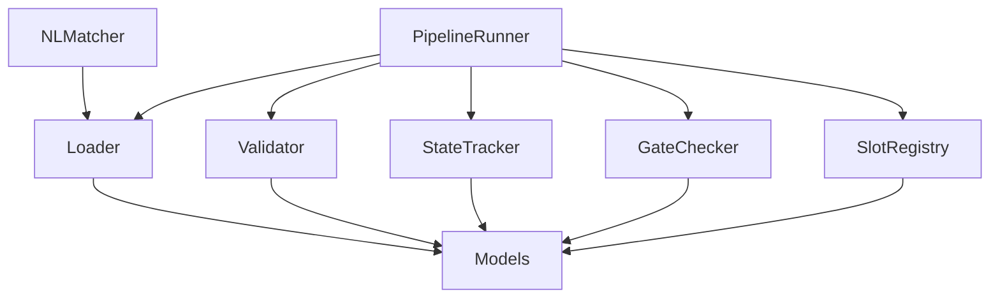
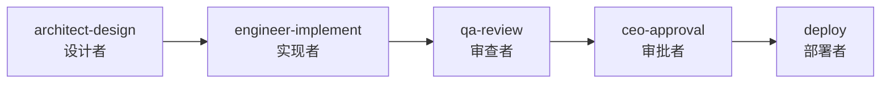

<p align="center">
  <h1 align="center">Agent Orchestrator</h1>
  <p align="center">
    基于 YAML 的 DAG 工作流引擎，用于多智能体开发协同
  </p>
</p>

<p align="center">
  
  
  
  
</p>

<p align="center">
  <a href="#快速开始">快速开始</a> |
  <a href="#系统架构">系统架构</a> |
  <a href="#api-参考">API 参考</a> |
  <a href="#流水线模板">流水线模板</a> |
  <a href="../README.md">English</a>
</p>

---

## 什么是 Agent Orchestrator？

Agent Orchestrator 是一个**基于槽位的流水线引擎**，用于协调多个 AI 智能体执行复杂的开发工作流。它不直接绑定具体的 Agent，而是定义每个步骤**需要什么类型的工作**（槽位类型），然后根据能力匹配将 Agent 分配到对应的槽位。

**解决的核心问题：** 当你拥有一支由多个专业 AI Agent 组成的团队（架构师、工程师、QA、研究员等），你需要一种结构化的方式来：
- 定义工作的顺序和依赖关系
- 确保每个步骤的前置条件满足后才开始执行
- 在每个关卡验证交付物
- 持久化跟踪流水线状态，支持中断恢复
- 根据能力将合适的 Agent 匹配到对应任务

## 核心特性

- **槽位架构** -- 流水线定义抽象槽位（设计者、实现者、审查者），而非绑定具体 Agent。Agent 分配与工作流定义解耦。
- **DAG 执行** -- 拓扑排序的有向无环图，自动依赖解析、并行槽位检测、基于 Kahn 算法的环检测。
- **关卡检查** -- 支持 8 种关卡类型的前置/后置条件评估：`file_exists`、`slot_completed`、`delivery_valid`、`review_valid`、`tests_pass`、`custom`（YAML 字段 + 命令）、`approval`、`artifact_valid`。
- **防幻觉协议** -- 基于校验和验证的 `DELIVERY.yaml` 和 `REVIEW.yaml`，生产者与审查者指标交叉验证。
- **自然语言匹配** -- 将自然语言请求（支持中英文）匹配到流水线模板，基于关键词评分，无需 LLM 调用，纯确定性算法。
- **状态持久化** -- 基于原子写入的 YAML 状态跟踪，支持保存/加载/归档。通过定义哈希验证恢复中断的流水线。
- **能力匹配** -- Agent 能力（从 `.md` 文件的 YAML front-matter 解析）与槽位类型需求匹配，自动查找兼容的 Agent。

## 系统架构

引擎由 9 个模块组成，分为 3 层：

```
                    +-------------------+
                    |  PipelineRunner   |   <-- 编排层
                    +-------------------+
                    |                   |
          +---------+    +----------+  +-----------+
          | NLMatcher|   |GateChecker| |SlotRegistry|
          +---------+    +----------+  +-----------+
                    |                   |
          +---------+----+---------+---+-----------+
          |  Loader  | Validator  |  StateTracker  |   <-- 基础层
          +----------+-----------+----------------+
                    |
          +-------------------+
          |      Models       |   <-- 数据层
          +-------------------+
```



### 模块概览

| 模块 | 说明 | 代码行数 | 覆盖率 |
|------|------|---------|--------|
| `models.py` | 5 个枚举 + 14 个数据类（不可变 & 可变） | 292 | 100% |
| `loader.py` | YAML 加载 + 参数解析 + 类型转换 | 357 | 95% |
| `validator.py` | DAG 验证、环检测（Kahn 算法）、IO 兼容性 | 261 | 100% |
| `state.py` | 状态跟踪、原子持久化、保存/加载/归档 | 381 | 94% |
| `slot_registry.py` | 槽位类型注册 + Agent 能力匹配 | 279 | 92% |
| `gate_checker.py` | 所有关卡类型的前置/后置条件评估 | 459 | 96% |
| `runner.py` | 顶层编排引擎 | 343 | 99% |
| `nl_matcher.py` | 自然语言模板匹配（中英文） | 305 | 96% |
| `__init__.py` | 公共 API，导出 33 个符号 | 94 | 100% |

## 快速开始

### 环境要求

- Python >= 3.11
- PyYAML >= 6.0

```bash
pip install pyyaml
```

### 运行你的第一个流水线

```python
import sys, os
sys.path.insert(0, "engineer/src")

from pipeline import PipelineRunner

ROOT = os.getcwd()  # 在项目根目录运行
os.makedirs(f"{ROOT}/state/active", exist_ok=True)

runner = PipelineRunner(
    project_root=ROOT,
    templates_dir=f"{ROOT}/specs/pipelines/templates",
    state_dir=f"{ROOT}/state/active",
    slot_types_dir=f"{ROOT}/specs/pipelines/slot-types",
    agents_dir=f"{ROOT}/agents",
)

# 加载并准备一个调研流水线
pipeline, state = runner.prepare(
    f"{ROOT}/specs/pipelines/templates/research-task.yaml",
    {
        "research_topic": "websocket-optimization",
        "research_brief": "评估 WebSocket 库以降低延迟",
    },
)

# 查看哪些槽位可以执行
next_slots = runner.get_next_slots(pipeline, state)
print([s.id for s in next_slots])  # ['research']

# 启动一个槽位
state = runner.begin_slot(next_slots[0], pipeline, state, agent_id="RES-001")

# ... Agent 执行工作 ...

# 完成槽位
state = runner.complete_slot("research", pipeline, state)

# 打印状态
print(runner.get_summary(state))
```

### 用自然语言查找模板

```python
from pipeline import NLMatcher

matcher = NLMatcher("specs/pipelines/templates")

# 英文
results = matcher.match("I need to fix an urgent production bug")
print(results[0].template_id)  # hotfix

# 中文
results = matcher.match("开发一个新功能实现K线聚合")
print(results[0].template_id)  # standard-feature

# 从文本中提取参数
params = matcher.extract_params(
    "implement feature kline-aggregator in phase5",
    "standard-feature"
)
print(params)  # {'feature_name': 'kline-aggregator', 'phase_id': 'phase5'}
```

## API 参考

### PipelineRunner

流水线编排的主入口。

```python
runner = PipelineRunner(
    project_root: str,       # 项目根目录的绝对路径
    templates_dir: str,      # 流水线模板 YAML 目录
    state_dir: str,          # 状态文件持久化目录
    slot_types_dir: str,     # 槽位类型定义目录
    agents_dir: str,         # Agent .md 文件目录
)
```

| 方法 | 说明 | 返回值 |
|------|------|--------|
| `prepare(yaml_path, params)` | 加载、验证并初始化状态 | `(Pipeline, PipelineState)` |
| `get_next_slots(pipeline, state)` | 获取可执行的槽位 | `list[Slot]` |
| `begin_slot(slot, pipeline, state, *, agent_id, agent_prompt)` | 启动槽位（检查前置条件） | `PipelineState` |
| `complete_slot(slot_id, pipeline, state)` | 完成槽位（检查后置条件） | `PipelineState` |
| `fail_slot(slot_id, error, state)` | 标记槽位失败 | `PipelineState` |
| `skip_slot(slot_id, state)` | 跳过槽位（CEO 决策） | `PipelineState` |
| `get_summary(state)` | 获取可读的状态摘要 | `str` |
| `resume_with_pipeline(state_path, yaml_path, params)` | 从保存的状态恢复 | `(Pipeline, PipelineState)` |

### NLMatcher

自然语言模板匹配器。

```python
matcher = NLMatcher(templates_dir: str)
```

| 方法 | 说明 | 返回值 |
|------|------|--------|
| `match(nl_input)` | 按置信度排序查找匹配模板 | `list[TemplateMatch]` |
| `extract_params(nl_input, template_id)` | 从文本中提取参数值 | `dict[str, Any]` |
| `generate_summary(match, params)` | 生成可读的匹配摘要 | `str` |

### SlotRegistry

管理槽位类型和 Agent 能力匹配。

```python
registry = SlotRegistry(slot_types_dir: str, agents_dir: str)
```

| 方法 | 说明 | 返回值 |
|------|------|--------|
| `load_slot_types()` | 扫描并加载所有槽位类型 YAML | `None` |
| `load_agent_capabilities()` | 解析 Agent .md 的 front-matter | `None` |
| `get_slot_type(slot_type_id)` | 获取槽位类型定义 | `SlotTypeDefinition` |
| `find_compatible_agents(slot_type_id)` | 查找满足要求的 Agent | `list[CapabilityMatch]` |
| `validate_assignment(agent_id, slot_type_id)` | 检查 Agent 是否能填充槽位 | `CapabilityMatch` |
| `generate_slot_manifest(pipeline)` | 生成槽位清单（供 HR/PMO 使用） | `SlotManifest` |

### GateChecker

评估流水线槽位的前置/后置条件。

| 方法 | 说明 | 返回值 |
|------|------|--------|
| `check_pre_conditions(slot, state)` | 评估所有前置条件 | `list[GateCheckResult]` |
| `check_post_conditions(slot, state)` | 评估所有后置条件 | `list[GateCheckResult]` |
| `all_passed(results)` | 检查是否所有关卡通过 | `bool` |

## 流水线模板

| 模板 | 槽位数 | 说明 | 关键参数 |
|------|--------|------|----------|
| **standard-feature** | 5（设计 -> 实现 -> 审查 -> 审批 -> 部署） | 完整的功能开发生命周期 | `feature_name`, `phase_id` |
| **research-task** | 3（调研 -> 架构审查 -> CEO 决策） | 轻量级调研和分析 | `research_topic`, `research_brief` |
| **hotfix** | 4（实现 -> 审查 -> 审批 -> 部署） | 紧急缺陷修复，跳过设计阶段 | `bug_id`, `bug_description`, `affected_module` |
| **quant-strategy** | 6（范围界定 -> 调研 + 设计并行 -> 实现 -> 审查 -> 审批） | 量化交易策略开发 | `strategy_name`, `target_symbol` |
| **security-hardening** | 6（审计 -> 修复设计 -> 实现 -> 审查 -> 复审 -> 审批） | 双轮安全审计与加固 | `audit_scope` |

### 流水线 DAG 示例（standard-feature）



## 槽位类型

槽位类型定义了一个槽位**需要什么类型的工作**，与具体由哪个 Agent 填充无关。

| 槽位类型 | 分类 | 说明 | 要求的能力 |
|----------|------|------|-----------|
| **designer** | 架构 | 产出设计文档和接口定义 | `system_design`, `interface_definition`, `technical_documentation` |
| **implementer** | 工程 | 编写生产代码和测试 | `python_development`, `test_writing`, `delivery_protocol` |
| **reviewer** | 质量 | 独立验证交付物 | `independent_testing`, `code_review`, `delivery_protocol`, `cross_validation` |
| **researcher** | 调研 | 调查研究并产出报告 | `web_search`, `technical_analysis`, `structured_report_writing` |
| **approver** | 治理 | 做出通过/拒绝决策 | `decision_making` |
| **auditor** | 安全 | 执行安全审计 | `security_audit`, `owasp_review`, `infrastructure_review` |
| **deployer** | 运维 | 部署代码到目标环境 | `deployment`, `ssh_operations`, `service_management` |

## 扩展系统

### 添加新的流水线模板

在 `specs/pipelines/templates/` 中创建 YAML 文件：

```yaml
pipeline:
  id: "my-template"
  name: "我的自定义流水线"
  version: "1.0.0"
  description: "工作流描述"
  created_by: "ARCH-001"
  created_at: "2026-01-01T00:00:00Z"

  parameters:
    - name: "my_param"
      type: "string"
      required: true
      description: "一个必填参数"

  data_flow:
    - from_slot: "step-a"
      to_slot: "step-b"
      artifact: "output_doc"
      required: true

  slots:
    - id: "step-a"
      slot_type: "researcher"
      name: "步骤 A"
      depends_on: []
      # ... inputs, outputs, conditions, task, execution

    - id: "step-b"
      slot_type: "implementer"
      name: "步骤 B"
      depends_on: ["step-a"]
      # ...
```

### 添加新的槽位类型

在 `specs/pipelines/slot-types/` 中创建 YAML 文件：

```yaml
slot_type:
  id: "my-slot-type"
  name: "我的自定义角色"
  category: "engineering"
  description: "这个角色做什么"

  input_schema:
    type: object
    required: [input_doc]
    properties:
      input_doc:
        type: string
        description: "输入文档路径"

  output_schema:
    type: object
    required: [output_doc]
    properties:
      output_doc:
        type: string
        description: "输出文档路径"

  required_capabilities:
    - capability_a
    - capability_b

  constraints:
    - "必须遵循约束 X"
```

### 添加新的 Agent

在 `agents/` 中创建带 YAML front-matter 的 Markdown 文件：

```markdown
---
agent_id: "MY-001"
name: "我的 Agent"
capabilities:
  - capability_a
  - capability_b
  - capability_c
max_concurrent_slots: 1
---

# 我的 Agent

Agent 提示词和指令写在这里...
```

`SlotRegistry` 会自动解析 front-matter 并将此 Agent 纳入能力匹配。

## 项目结构

```
agent-orchestrator/
  agents/                          # Agent 提示词定义（.md + YAML front-matter）
    00-hr-agent.md
    01-architect-agent.md
    02-engineer-agent.md
    03-qa-agent.md
    ...
  architect/                       # 架构文档和交付物
    architecture.md
    DELIVERY.yaml
  engineer/                        # 流水线引擎实现
    src/
      pipeline/
        __init__.py                # 公共 API（33 个导出）
        models.py                  # 枚举 + 数据类
        loader.py                  # YAML 加载 + 参数解析
        validator.py               # DAG 验证 + 环检测
        state.py                   # 状态持久化 + 跟踪
        slot_registry.py           # 槽位类型 + 能力匹配
        gate_checker.py            # 前置/后置条件关卡
        runner.py                  # 编排引擎
        nl_matcher.py              # 自然语言模板匹配
    tests/
      test_pipeline/
        conftest.py                # 共享 fixtures
        fixtures/                  # 测试用 YAML/MD 文件
        test_*.py                  # 270 个测试
    DELIVERY.yaml                  # 防幻觉交付清单
  qa/                              # QA 审查产物
    REVIEW.yaml
    additional-tests/
  pmo/                             # 项目管理
    wbs/implementation-wbs.md
    team-registry.md
  specs/                           # 规格说明
    integration-contract.md        # 所有模块的接口契约
    delivery-protocol.md           # DELIVERY/REVIEW.yaml 协议
    pipelines/
      templates/                   # 流水线 YAML 模板（5 个）
      slot-types/                  # 槽位类型定义（7 个）
      schema.yaml                  # 流水线 YAML 模式
      implementation-guide.md      # 模块实现指南
    research/
      pluggable-pipeline-research.md
  docs/
    README_zh-CN.md                # 中文文档（本文件）
  QUICKSTART.md                    # 快速上手指南
  FILE-STANDARD.md                 # 文件/目录规范
```

## 测试

```bash
cd engineer
PYTHONPATH=src python3 -m pytest tests/test_pipeline/ -v --cov=src/pipeline --cov-report=term-missing
```

**结果：** 270 个测试通过，97% 整体覆盖率。

```
模块                     语句数   覆盖率
pipeline.__init__           9     100%
pipeline.models           175     100%
pipeline.loader           127      95%
pipeline.validator        123     100%
pipeline.state            152      94%
pipeline.slot_registry    106      92%
pipeline.gate_checker     184      96%
pipeline.runner            93      99%
pipeline.nl_matcher        96      96%
合计                     1065      97%
```

## 防幻觉协议

本项目使用结构化的交付协议来防止 AI Agent 幻觉测试结果：

- **DELIVERY.yaml** -- 生产者声明文件校验和、测试数量、覆盖率。每个文件都有 sha256 校验和。
- **REVIEW.yaml** -- 审查者独立运行测试、计算校验和，与生产者声明交叉验证。
- **交叉验证** -- 如果 QA 指标与生产者指标偏差超过阈值，交付物会被标记为可疑，无法通过审查。

详见 `specs/delivery-protocol.md`。

## 贡献指南

1. Fork 本仓库
2. 创建功能分支：`git checkout -b feature/my-feature`
3. 遵循 `specs/integration-contract.md` 中的接口契约
4. 编写测试，覆盖率 >= 85%
5. 按照 `specs/delivery-protocol.md` 产出 `DELIVERY.yaml`
6. 提交 Pull Request

## 许可证

本项目基于 Apache License 2.0 许可证。详见 [LICENSE](../LICENSE)。

---

<p align="center">
  基于槽位编排构建 -- 定义需要做什么工作，而不是谁来做。
</p>
